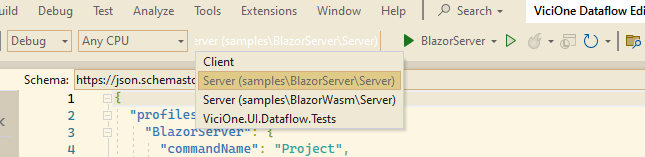
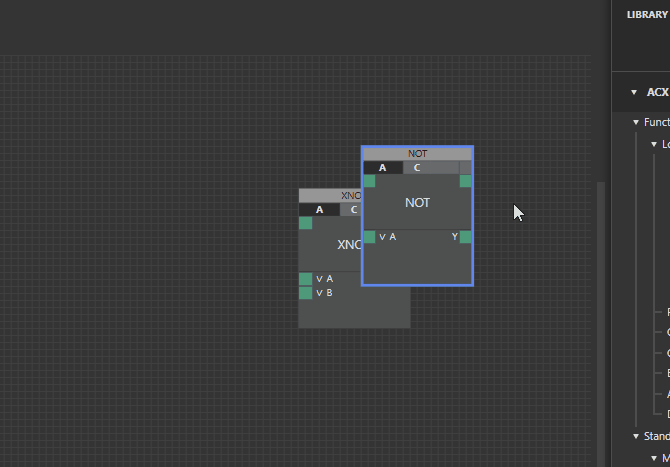
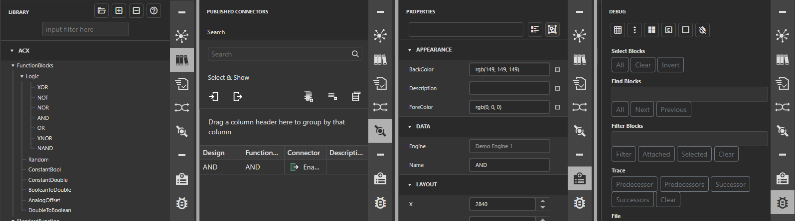

# Quickstart

Short guide for the datafow editor, version from 2023-04-20.

## Development

### Prerequisites
- Visual Studio or a compatible editor in the current version
- Node.js >= 18.5

### npm
- After checkout run `npm install` in `/src/ViciOne.Ui.ClusterEditor/`
- Run `npm run build` after that or when changing the JS code

### Run the project
- Use `Debug` configuration and the `BlazorServer` project
- The project runs on `localhost:57006`

## Navigation

### Diagram "GimpBehavior"
- Default in "Debug" configuration

- Mouse wheel: scroll up/down
- Shift + wheel: scroll left/right
- Alt + wheel: zoom in/out
- Spacebar: zoom to fit (selected objects / all objects)
- Middle mouse + drag: pan

### Diagram "VOBehavior"
- Default in "Release" configuration

- Mouse wheel: zoom in/out

### General
- Middle mouse + drag: pan
- Spacebar: zoom to fit (selected objects / all objects)
- Scrollbars and minimap can also be used for navigation
- Edge panning: left mouse down and moving near an edge reveals 3 of the 8 areas can will pan the diagram when you touch them  

- Left mouse + drag: selection rectangle

## Right side menu
Most menu options are still empty placeholders in this development phase, only the right sidebar has some content.  

- Library
  - Demo elements are automatically loaded
  - To create a FunctionBlock, drag it from the library to the diagram
- Published Connectors
  - Connectors are the ports of a node, in the context menu you can "Publish" them to show up in this list
  - You can drag them from this list to other connectors to create a "virtual" link
- Property Grid
  - Select elements (except links for now) to adjust their properties
  - There is no color editor yet, color values have to be entered as rgb/rgba values
- Debug
  - Debug features and features that are not in any menu yet
  - Useful is "Generate Blocks" to create a bunch at once, the name is from the library
  - Save/Load uses localStorage to store dataflows as json, that also means there is a hard 5 MB cap, if the dataflow is too big the program might crash

## Context menu
The diagram, all diagram nodes and ports have a custom context menu.

## Elements

- All elements can be selected either by clicking or the selection rectangle
- The elements FunctionBlock, Container, Label have tooltips

### FunctionBlock
- "Normal" nodes, created by dragging from the Library
- Double click opens Settings (only a few blocks have settings right now, e.g. "Random", "TimeOfDay24h")
- Double click on the name opens the Property Grid with the name selected

### Container 
- Created by the context menu
- Act as folders
- Double click to enter, Esc the leave or use the breadcrumb at the bottom for navigation

### Label
- Created by the context menu
- ~Double click to edit content~ currently disabled
- Size can be changed with the mouse at the edges

### Connectors
- The ports of a node
- Can be added to its parent container via the context menu

### Links

- Can be created by dragging from connectors on the right side of a node (Output connectors) to connectors on the left side (Input connectors)
- Can also be created by dragging on an existing link
- Double click jumps to and selects either the source or target node, depending on the position of the click

### Debug Console

The debug console component and service provide a way to debug values and functions in a more convenient way then the browser or Blazor-Server in some cases. The following features are provided:

- Log values to the console and display them with the current value including a configurable amount of history (default ten)
- Log messages to the console similar to `Console.Out.WriteLine()` with configurable history (default 100)
- Add custom buttons to trigger functions separately from their default call context or entirely custom ones
- Logged messages automatically contain caller member information like name and line number

View the full functionality and how to use it [here](features/debug-console.en.md)
